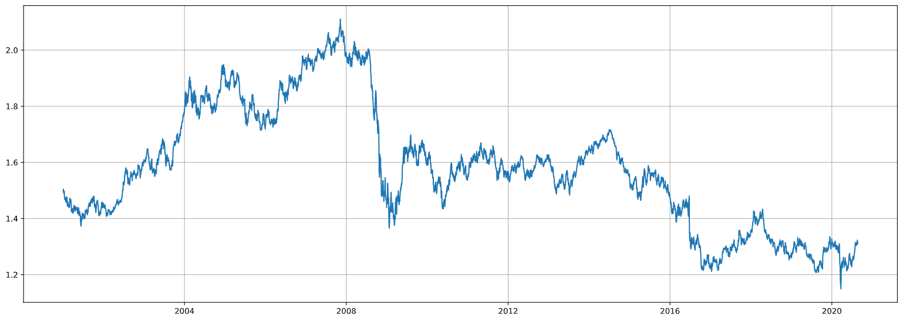
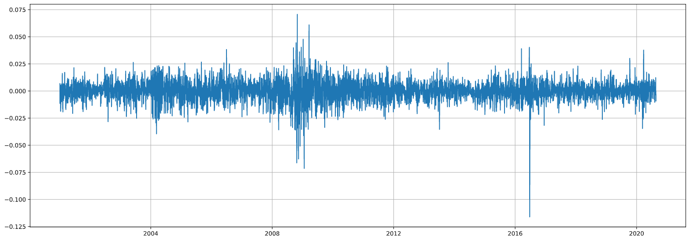
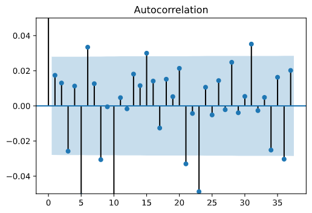
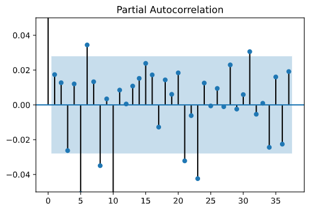
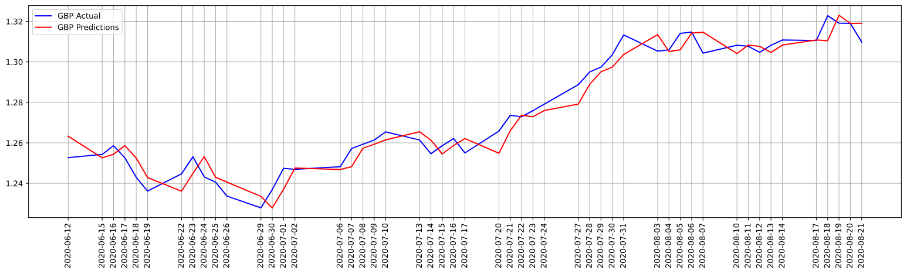
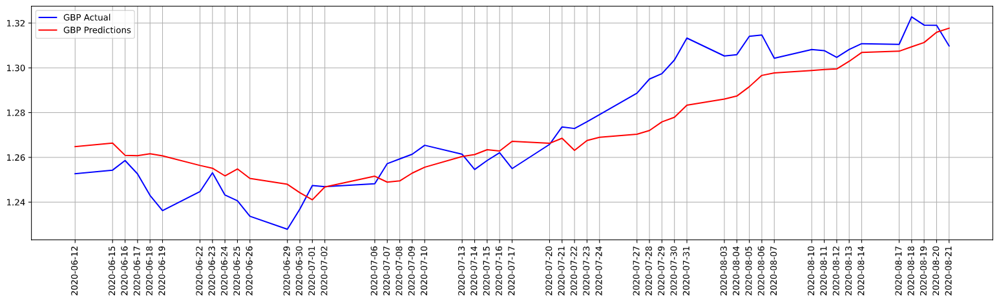
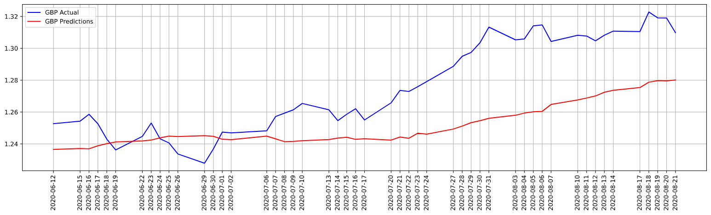
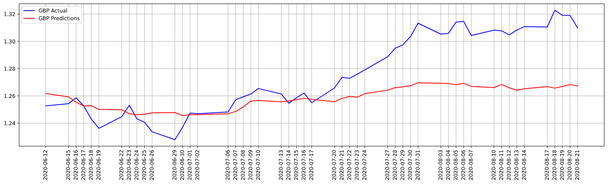
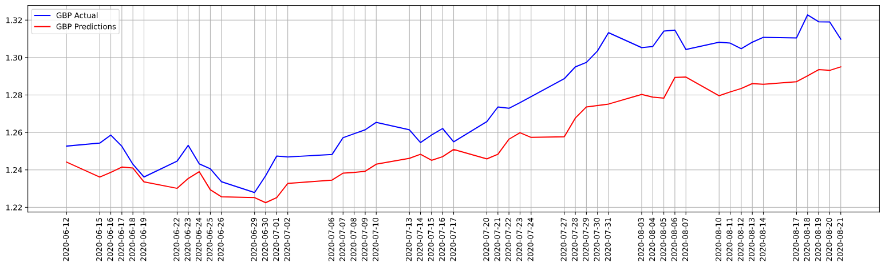

<center><font size="7"> Exchange Rate Prediction</font></center>  
<br/>
<center><font size="6"> by Evrim Akgul</font></center>  
<br/>
<center><font size="5"> Sunday, October 18, 2020</font></center>  
<br/>
<br/>
<br/>

<div style="text-align: right">
<font size="5"> MSDS 692 - Data Science Practicum I</font>  
</div>
<div style="text-align: right">
<font size="5"> Instructor: Christy Pearson</font>
</div>

<br/>
<br/>
<br/>

# I. About the Project

As a student of Regis University, MSc. Data Science program, I was obligated to get two practica classes and turn in a project for each of the classes. I am coming from a background of Economics and Finance. For my first practicum class, considering my backgroud as well, I picked a project something that I can contribute from the finance point of view. This way, I am hoping that I can provide some basic information regarding the field besides the other technical information of the data science aspect, as well.

    Summary:
    During the project, I have used GBP/USD time-series for my data. My intention was to come up with a robost machine learning method (more precisely a deep learning (**DL**) architecture) that can predict the GBP/USD exchange rate sucessfully. When I say successfuly, what I mean is a model that is providing better results than literature suggested statistical (econometrical) methods. During this project, I used ARIMA process for the base model, and I used 4 different **DL** architecture for comparison purposes: MLP Univariate, CNN Univariate, MLP Multivariate, CNN Multivariate. To my disappointment, none of the **DL** architectures were good enough to produce better results than ARIMA process.

<br/>

# II. About Exchange Rates and Time Series

In finance, an exchange rate is a measure between two currencies. At this rate one currency is exchanged for another. It is also regarded as the value of one country’s currency in terms of another currency. Exchange rates are determined in the foreign exchange market, which is open to buyers and sellers, and where currency trading is continuous. From this perspective, Exchange Rates are financial time-series, but at the same time a major role player for economic decisions due to its importance and effect on all sorts of economic activities. Thus, exchange rates forecasting has a substantial role in the economic decision making processes. Accurate estimation of the rate has significant influence on successful decisions.

In terms of modelling forecast methods, it is essential to understand features of exchange rates in order to develop decent models. First and foremost, exchange rates are sequenced data. The transactions executed one after another and with a timestamp, hence they produce time-series data. Besides the sequenced nature of them, their other notable feature is that they are nonlinear and nonstationary, meaning they are nondirectional and ever changing without presenting any regularity. 

In terms of modelling time-series data, the literature suggests some statistical (or econometric) modelling methods such as (S)ARIMA, ETS (for univariate series), or VAR (for multivariate series) to be employed. In general, machine learning and more precisely deep learning applications are highly successful to map irregular data. Regarding this phenomenon, this project intends to compare some Deep Learning methods with literature suggested econometric methods. In this project, Box-Jenkins' ARIMA methodology will be used as a baseline model (acquired from the time-series forecasting literature), while MLP and CNN techniques will be getting employed for Deep Learning models. Lastly, I have chosen GBP/USD (British Sterling / US Dollar) rate to represent a financial time-series to this project.

As a note, I should add this as well. Machine Learning methodologies offer Recurrent Neural Networks (RNN) and Long-Short Term Memory (LSTM) approaches for sequence to squence data analysis as well. Yet, with the given time constraints, I had to exclude these methods. I am hoping to further analyse them as a continuation study to this project in the near future.

# III. Problem Statement and Difficulties

I have mentioned this above already, yet it would be a good idea to reiterate some of it and emphasize a few different points. Exchange Rates are very important components of economy. Not only for macroeconomics, as being one of the major indicator, it is also very important in the micro level for the constituents of the economic activities such as international traders or even for local farmers due to the fact that it can be a cost factor to their businesses such as oil prices or logistic costs. Empowering correct expectation to the actors of economy, forecasting exchange rates plays a significant role. AS the dictator of the monetary policies, central banks are the main employers of these forecasting models. While technology keeps developing, probing and testing for alternative methods and exploring new possibilities is a good excercise for the betterment of the current methods.

That being said, I have to admit that I had a great deal of hardship to define this problem statement. The main reason to that was the discrepancy among the time constraint, my desires and expectation from this project and the requirements of the practicum. My understanding is that a business related project that can contribute to a solution regarding a general real world problem or a spesific problem of a business was what was expected from me. Yet, my desire was working on an academic or research topic matter rather than what was expected from me. At this point, I made a mistake and started to work on developing models without clarifying my problem statement. I guess it was around 6th week when I realized my mistake because I was creating models, testing hyperparameters, producing results etc, however, none of them were a material to relate something. With the support of my instructor, I managed to narrow down my focus and eventually came up with the above statement.

# IV. Milestones of the Project

## 1. Data Collection

In order to conduct my project, I had to collect some data for my project. I started with the primary data: GBP/USD exchange rate. I was looking for the daily exchange rate data for this project. My first, collection of series was from "https://www.investing.com/". The data was coming with the **Date, Price, Open, Hight, Low, Volume and Change(%)** structure. Later on my project, I have discarded this data and collect a new dataset from FED, including the other **22 exchange rate parities** (which I used for the multivariate analysis models) along with the **GBP/USD parity**.

    Forex (daily -  AUD, EUR, NZD, GBP, BRL, CAD, CNY, DKK, HKD, INR, JPY, MYR, MXN, NOK, ZAR, SGD, KRW, LKR, SEK, CHF, TWD, THB, VEB.), from https://www.federalreserve.gov/, from 2000-01-03 to 2020-08-21.

My second data source was Federal Reserve Bank of St.Louis. I have collected **libor (interest) rates** and **normalized GDP** data (both for US and UK, data downloaded separately) from here.
    Normalized GDP (monthly), from https://fred.stlouisfed.org/ from 2000-01-01 to 2020-05-01.
    
    Libor Rates (daily), from https://fred.stlouisfed.org/, from 2001-01-02 to 2020-09-18.

Lastly, I acquired current account to GDP data from OECD’s website.
    Current Account to GDP (quarterly), from https://stats.oecd.org/, from Q1-2000 to Q1-2020.

All my data was collected as `CSV` files. Excel is used to delete some useless rows and columns, when I have downloaded the data first time, but all of the data cleaning and processing is done on python in `Data Preparation.ipynb` notebook. I preferred and used Juypter notebooks at every step of my project, due to the step-by-step functionality and clean cell looking.

At this phase, I organized my data in a way that I can use during my analysis. First, I organized my exchange rate data. This one needed the most cleaning among all of them and the data were provided daily.

Second, I cleaned and integrated the GDP data to Forex (stands for Foreign exchange rate) data. GDP data was monthly, thus I had to fill the missing data by interpolating the monthly data to the daily data of the Forex.

Third, the Current Account to GDP data, similarly, I needed to fill the missing data by interpolating quarterly data to Forex' daily data.

Fourth, Libor Rates were provided daily, but they were not numerical.

After cleaning and merging all these data, I saved them to a new CSV file that I named `Merged` and for further analysis, I pulled the data from this file.

## 2. Data Preparation

### a. Foreign Exchange Rates

I started processing my set with the forex data. Parsing the dates and assigning them to the idex column, gave me the index values that are datetime object. However, the rest of the data, forex values, were read as object, whereas they were supposed to be numerical. The reason for that was missing values for holidays that are marked with **"ND"** in the dataset. So I needed to clean them first and then convert my dataset values to numerical.
    learning curve: droping the rows with **"ND"** values and converting the objects to numeric values.

### b. GDP

I had GDP data separately for UK and US from the same source. I read the data from `CSV` files as *series* and then concatanated them to a dataframe. Merging it with the previous Forex dataframe was the next. 
    learning curve: reading data from the file with `squeeze=True` argument, merging dataframes in accordance with the needs.

### c. Current Account to GDP

I needed to get rid of the first row because I mistakenly got one extra quarter data from the source. The data was quarterly and the date information was given in **"Qx-YYYY"** format. I needed to search for some time to find a way to convert it to datetime series, but I figured it out. The rest of the data was OK. After the conversion, I merged it to the previous dataframe.
    learning curve: converting the quarterly data information to datatime series.

### d. Libor Rates (interest RAtes for GBP and USD)

I acquired the data in two separate `CSV` file. Read the data as *series*, parsed the dates and assigned them to the index and then concatanated the *series*. There were missing data in the dataframe given in **"."**. The values were not numeric. Converted them into proper format, and merged with the previous dataframe.
Due to merging data with different time frames (daily, monthly and quarterly), there were missing values. Using interpolation method, I filled them. The reason to do that was the characteristics of the financial data. For instance, a monthly GDP information is given during the daily changes of exchange rates or libor rates. Market gives reaction, whenever a new GDP information gets into the market, yet during that one month period all the valuation are made in accordance to the previous GDP data. Even after interpolation, there were still missing data and these were from the Libor interest rate data (for the entire year of 2000). I dropped these rows with `NaN` values. Thus, my ready to process data starts from the beginning of 2001.

Eventually, I had 29 different data (28 of them to be predictor variable) and 4920 observation for each of them. I saved my pre-processed data to a new `CSV` file: **"Merged.csv"**


## 3. Base Model (ARIMA)

My intention was creating a base model for comparison purposes, first, using the econometric ARIMA process. Thus, I read the data and extract the GBP series for univariate analysis.



After reading the data from the file, my response variable (the one the I will be trying to predict, which GBP/USD rate) looks like this. This data is from the beginning of 2001 and it goes until 2020 August. As we may observe from the chart, the rate fluctuates between 1.2 and 2.2; indicating that depending on the time period, a Sterling can buy from 1.2 Dollars to 2.2 Dollars.

My baseline model that I will be comparing the success of the deep learning methods, is ARIMA. ARIMA stands for Autoregressive Integrated Moving Average and it has three main elements: The first one is the **I** component and it means Integrated). For an ARIMA process, we have make sure that our data is stationary. In order to provide that, we start with a statistical test observing the stationarity/nonstationarity information: *Augmented Dickey Fuller* test. Literature suggests that a statistical analysis can be conducted if the series is stationary. We know that financial data are non-stationary and the test confirms that fact. In order to make a series stationary, we have to take differences of the observations, until the series gets stationary. We reach to that level after taking the first difference of the series and this is the **I = 1** part of the ARIMA process.



As we may observe, now the series is not ever changing, but of course it is full of white noise on a linear path. There are two violent movements that can attracts our interest. First one is around 2008, which is the time for sub-mortgage financial crisis and the second one is at 2016, 24 June, which is the day after BREXIT referendum. It is quite understandable, why these periods are so much volatile.

Our next step in ARIMA process is the determination of **AR (Autoregressive)** and **MA (Moving Average)** parts. These two can be determined at the same time with `autocorrelation` and `partial autocorrelation` plots. 




Both of the plots shows that the correlation dies away after the first readings. By looking at these dying autocorrelations *(AR = 1, MA = 1)*, we can tell that an **ARIMA (1,1,1)** process is what we are after. First, and last 1’s representing AR and MA levels, whereas the middle 1 representing the difference level.

In accordance with these information, we conduct our ARIMA process. By plotting the residuals conducted above suggested process is this:


The residual distribution is very close to normal distribution, confirming that we have done our job in this ARIMA process correctly.

For the test set I have separated last 50 observation of the data. Using the process the baseline model is created. The prediction vs actual comparison graph looks also good.



Our evaluation criteria will be RMSE (root mean square of the errors) which is one of the mostly used evaluation metric for time-series data. We see that 0.00643 is the score. As a note, the lower the metric better the prediction is.

## 4. MLP Univariate

The first machine learning methods applied in this project is 
Multi Layer Perceptron for UNIVARIATE analysis. Similar to the baseline model, we read our data from the file, first. Different than the ARIMA process though, we have to process our data furthermore for neural networks. 

Since this is a univariate analysis, the data must predict itself. But of course, we cannot use today’s data to predict today. We should be using yesterday’s data to predict today and today’s data to predict tomorrow. In a sense, we will be using the same data shifted … a lagged value of itself. Obviously, we can use a data that is 2 or 3 or more days earlier. This is a level that we decide for the lag value.

I will be predicting 50 days’s data, thus I decided to use a lag value for 50 days, though I could have chosen my lag value different, too. It is just a personal preference. I used this function to formulate and create lagged values:

```Python
def CreateLaggedSequence(data, lag):
    # make two lists for PredictorSequences and ResponseVariables
    PredictorSequences, ResponseVariables = list(), list()
    for i in range(len(data)):
        # mark the range of the sequence
        end_i = i + lag
        # check when the data ends
        if end_i+1 > len(data):
            # stop sequence creation
            break
        # get the predictors and responses
        PredictorSequence = data[i:end_i]
        ResponseVariable = data[end_i]
        # append them to the lists
        PredictorSequences.append(PredictorSequence)
        ResponseVariables.append(ResponseVariable)
        # print(end_i)
    return np.array(PredictorSequences), np.array(ResponseVariables)
```

After organizing the data and separating the test group, we can run our model. Yet, as an extra effort, I have written an activation function called “Swish”. It is a relatively newly proposed activation function by Google Brain Team and it tends to work better than usual functions. I will be using it in my models, hoping that it could provide better approximations and thus mapping.

```Python
def swish(x, beta = 1):
    return (x * sigmoid(beta * x))

from keras.utils.generic_utils import get_custom_objects
from keras.layers import Activation
get_custom_objects().update({'swish': Activation(swish)})
```

After running our model, I acquired Test RMSE: 0.01295. The prediction vs actual graph is here:



I believe it would be OK to say that there is a good match, yet the evaluation metric is not as good as ARIMA process.

## 5. CNN Univariate

The second machine learning model is the univariate prediction with CNN architecture. After a similar process to the previous one with little changes, we run our model and get somewhat decent mapping and result. Test RMSE is 0.03028. The score is 2,5 time worse than MLP_U model.



## 6. MLP Multivariate

My third model is the MLP architecture but this time with multivariate analysis. In this process I use all the data that I gathered for the project with the hope to acquire better results. I lower the lagged values to 5 from 50 comparing to the previous models. Yet there are 28 more variables in equation. 22 of them being other exchange rates and the rest are main macroeconomic indicators for both country US and UK. The test score for MLP_M seems a tad bit better than CNN_U model: 0.02739.



## 7. CNN Multivariate


My last model in this project is for multivariate analysis with CNN architecture.
In origin, CNN architecture is designed to grasp features from images to be employed for image recognition. Yet shows remarkable capability to extract features from sequenced data as well. Time-series being a sequenced data provides a good opportunity to test CNN architectures abilities. This model seems more successful than its univariate counterpart. The RMSE metric is 0.02076. 

At this point, I believe an alternative could be feeding the different groups of variables separately, to this CNN architecture, by using functional API. It is a useful tool especially in such cases where different variables are presented and affecting the response in different ways.



# V. Closing Remarks

## 1. Packages and Liabraries

During this project I have used different packages and liabraries. First of all, this project is conducted on two basic elements: `Python` and `CSV` files. `CSV` files were the source of data acquired to be used in this project and the rest of the work is conducted by using `Python` language. From the `Python`, packages that are used:
- Pandas
- Numpy
- Scikit-learn
- matplotlib (and pyplot)
- statsmodels (for ARIMA model and statistical tests)
- math
- time
- tensorflow (keras --> for deep learning models)

## 2. Scientific Approach

During this study, there was one thing that I was thinking constantly: literature suggests classical econometric models provides better results than machine learning methods. I was thinking that it should not be the fact. Yet my efforts showed me that it is true, at least until I can create a model that is better. I believe there are some reasons behid this. During my test, I believe I have tried around 200-300 different models. Yet none of them were as succesful as the ARIMA model. At this point, I am just eager to read more, learn more and try more. For instance, Keras provides a service called **functional API**. I believe using the APIa nd by grouping the different types of predictor separately, better results can be achieved. Yet, I have to try them some another time.

### 3. Review and Conclusion

When we compare the results we can see that the literature findings are correct. The base model for the prediction has the best metric by far. While the result of the base model is 0.00643, the closest result to that one is 0.01295 from the Univariate MLP architecture. Then comes the CNN multivariate prediction process with 0.02076, and MLP multivariate process with 0.02739 thereafter. The CNN univariate process has the worst score with 0.03028.

A small reminder is needed regarding these results as well. The ARIMA process is a linear regressor, thus the results of the process would be the same even if we repeat it again, yet that cannot be told for the deep learning processes. In all of these deep learning processes, random factors are used, therefore the results of each process change each time it runs. Whereas it can get better, it is similarly probable that they can get worse. And actually, I had my presentation video for this project before finishing the `README.md ` and the results that I have in that video is quite different that these ones.

While I am coming to the end of my presentation, I would like to be thanking you wholeheartedly to whom showed interest in my project and presentation; it is relatively a long project and presentation. Nonetheless, I have to mention some of my references no matter what and recognize them. Majorly and thankfully, I referred to Jason Brownlee’s instructions numerous times. His books, website (machinelearningmastery.com), teachings and tricks … I utilized them happily. I guess I could have not finished this project without his aidence. Along with that, all the libraries, packages and modules that I used were great gifts … to me and to all the people uses them and benefits them. I have learned so much by referring to their documentations excessively. And lastly, for all the small hick-ups and issues, there was stackoverflow and the community that shares willingly and vigorously.
A special thanks to you, bearing with me and to my instructor Christy Pearson, helping me along the way with her guidance, providing a great support and with her welcoming smile.

All the best,  
Thank you


